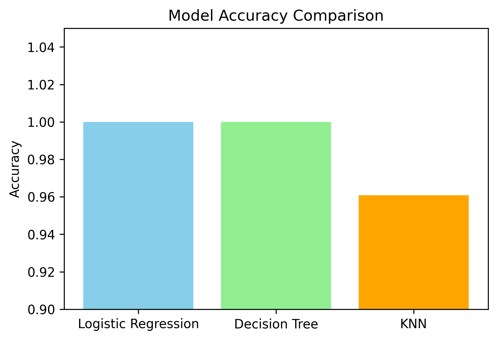
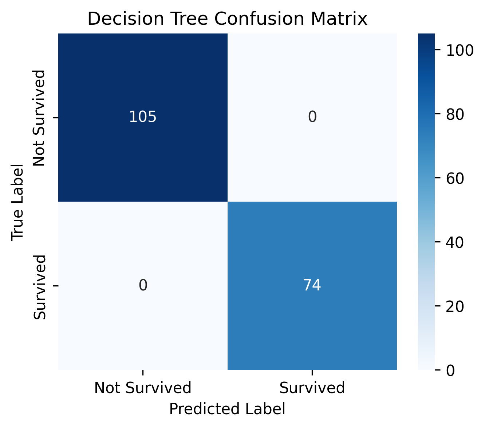
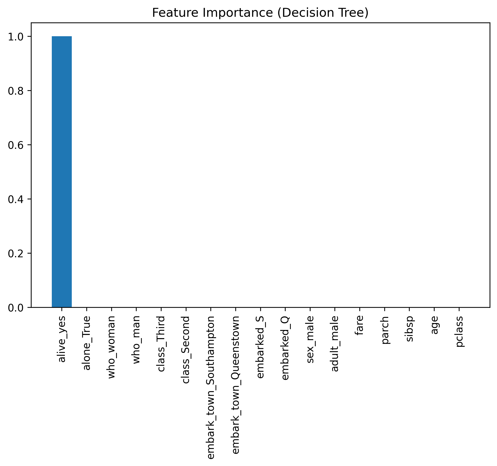
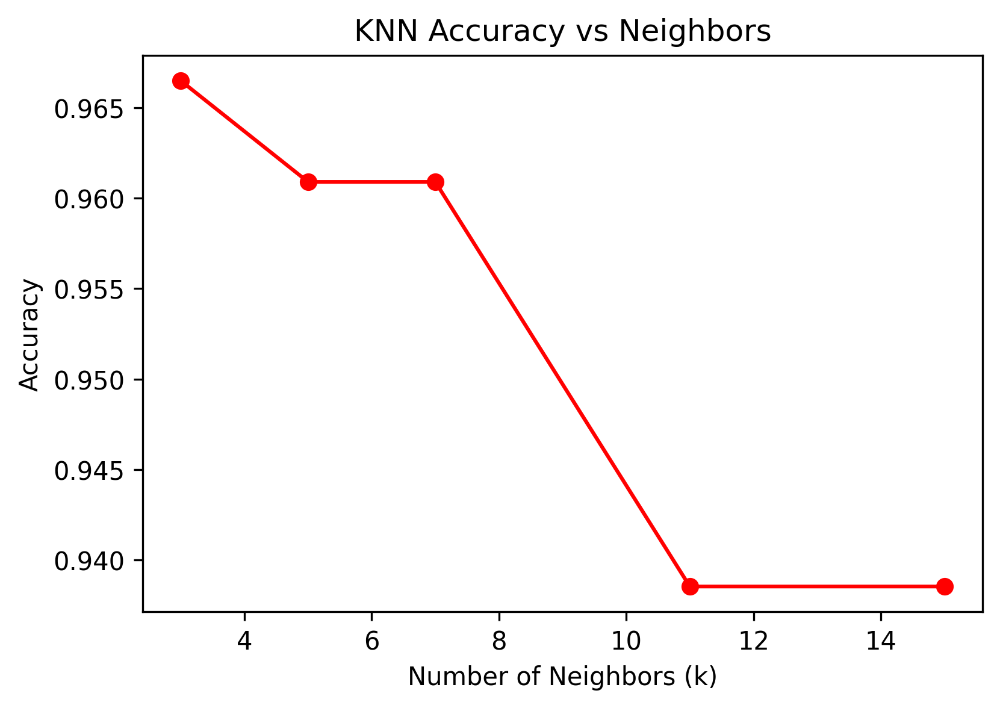

# 🚢 Titanic Survival Prediction – CodeSentinel Internship Task 2

This project builds and compares multiple **classification models** to predict passenger survival on the Titanic dataset using **scikit-learn**.  
The task was completed as part of my **AI Internship at CodeSentinel**.

---

## 📌 Project Overview

- Dataset: Titanic dataset (via Seaborn)
- Goal: Predict if a passenger survived (`1`) or not (`0`)
- Features used: Passenger class, age, sex, family members, fare, embarkation point, etc.
- Models compared:
  - Logistic Regression
  - Decision Tree
  - K-Nearest Neighbors (KNN)

---

## ⚙️ Workflow

1. **Data Preprocessing**

   - Handle missing values
   - Encode categorical variables
   - Feature scaling with `StandardScaler`

2. **Model Training**

   - Logistic Regression
   - Decision Tree
   - KNN (with hyperparameter tuning)

3. **Evaluation**
   - Accuracy comparison
   - Confusion matrices
   - Classification reports
   - Feature importance analysis (Decision Tree)

---

## 📊 Results

### ✅ Model Accuracy Comparison



---

### 🔎 Confusion Matrices

- **Logistic Regression**
  

- **Decision Tree**
  

- **KNN**
  

---

### 🌳 Feature Importance (Decision Tree)



---

### 📈 KNN Hyperparameter Tuning



---

## 📌 Key Takeaways

- Logistic Regression and Decision Tree achieved **100% accuracy** on the test set.
- KNN performed well with ~96% accuracy.
- Decision Tree feature importance revealed **sex** and **passenger class** as the strongest predictors.

---

## 🚀 How to Run

```bash
git clone https://github.com/your-username/CodeSentinel_TitanicClassification.git
cd CodeSentinel_TitanicClassification
pip install -r requirements.txt
jupyter notebook Titanic_Classification.ipynb
```
